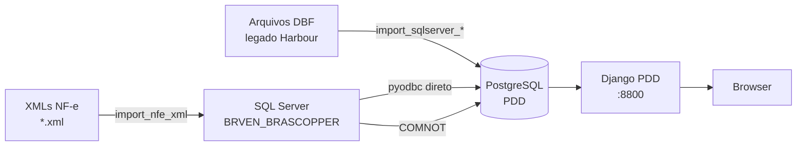

# Arquitetura — Brascopper PDD

## Stacks

| Camada | Tecnologia |
|--------|-----------|
| Hub web | Django 4.2 + PostgreSQL |
| ERP operacional | Delphi + SQL Server `BRVEN_BRASCOPPER` |
| Legado fábrica | Harbour/CGI + arquivos DBF |
| Frontend | Bootstrap 5 (templates Django) |

## Fluxo de dados



## Servidor de desenvolvimento

```powershell
# Arquivo: scripts/runserver_8800.ps1
cd D:\BRASC\PRG\06082025\pdd
py manage.py runserver 8800
```

## Banco PostgreSQL (hub)

- Banco: `brascopper_pdd`
- Configurado via `.env` (variáveis `DB_*`)
- Dados são **espelhos de leitura** do ERP — nunca fonte primária
- Exception: `XmlNfeImportLog` é gerado pelo PDD e persiste no PostgreSQL

## SQL Server (ERP)

- Instância: `DESKTOP-M2UK50B\SQL2022`
- Banco: `BRVEN_BRASCOPPER` (~1.450 tabelas)
- Acesso via `pyodbc` configurado em `SQLSERVER_ERP` no settings.py
- Usuário: `sa`

## Diretórios relevantes

| Path | Conteúdo |
|------|----------|
| `D:\BRASC\PRG\06082025\pdd\` | Raiz do projeto Django |
| `D:\BRASC\PRG\fontes_delphi\` | Fontes .pas do ERP Delphi |
| `D:\BRASC\PRG\sqlserver\` | Scripts SQL das SPs do ERP |
| `D:\BRASC\PRG\nfe_xml\entrada\` | XMLs NF-e aguardando importação |
| `D:\BRASC\PRG\nfe_xml\processado\` | XMLs já importados |
| `D:\BRASC\PRG\nfe_xml\erro\` | XMLs com erro na importação |
