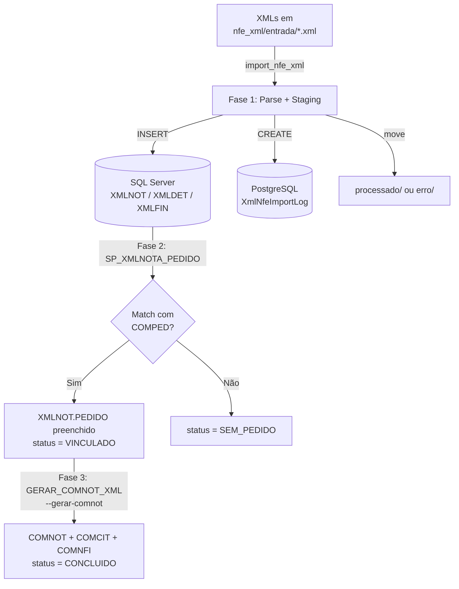

# Pipeline de Importação XML NF-e

## Visão geral do fluxo



## Comando

```powershell
# Importar + vincular
py manage.py import_nfe_xml --diretorio D:\caminho\xmls

# Importar + vincular + gerar COMNOT
py manage.py import_nfe_xml --diretorio D:\caminho\xmls --gerar-comnot

# Apenas re-vincular pendentes (sem reimportar arquivos)
py manage.py import_nfe_xml --vincular-apenas

# Dry-run (sem gravar)
py manage.py import_nfe_xml --diretorio D:\caminho\xmls --dry-run
```

## Diretórios (configuráveis via .env)

| Variável | Default | Uso |
|----------|---------|-----|
| `NF_XML_INPUT_DIR` | `D:\BRASC\PRG\nfe_xml\entrada` | XMLs aguardando importação |
| `NF_XML_PROCESSADO_DIR` | `D:\BRASC\PRG\nfe_xml\processado` | XMLs importados com sucesso |
| `NF_XML_ERRO_DIR` | `D:\BRASC\PRG\nfe_xml\erro` | XMLs com erro |

## Tabelas de staging (SQL Server)

### XMLNOT — cabeçalho

| Campo | Tipo | Origem XML |
|-------|------|-----------|
| `REGISTRO` | numeric(10) | `MAX(REGISTRO)+1` |
| `IDE_NNF` | numeric(10) | `<nNF>` |
| `IDE_DEMI` | datetime | `<dEmi>` |
| `EMIT_CNPJ` | char(15) | `<emit><CNPJ>` |
| `EMIT_XNOME` | varchar(60) | `<emit><xNome>` |
| `INFPROT_CHNFE` | varchar(45) | `<protNFe><infProt><chNFe>` |
| `TOTAL_VNF` | numeric(12,2) | `<total><ICMSTot><vNF>` |
| `TOTAL_VPROD` | numeric(12,2) | `<total><ICMSTot><vProd>` |
| `CREDOR` | numeric(5) | lookup `CADFOR.FORNEC` por CNPJ |
| `PEDIDO` | numeric(9) | preenchido pela `SP_XMLNOTA_PEDIDO` |
| `NOME_ARQUIVO` | varchar(100) | nome do arquivo .xml |

### XMLDET — itens

| Campo | Tipo | Origem XML |
|-------|------|-----------|
| `DET_ITEM` | numeric(3) | `<det nItem="...">` |
| `DET_CPROD` | varchar(30) | `<prod><cProd>` |
| `DET_QTRIB` | numeric(12,4) | `<prod><qTrib>` |
| `DET_VUNTRIB` | numeric(15,4) | `<prod><vUnTrib>` |
| `PEDIDO` | varchar(20) | `<prod><xPed>` (ou SP) |
| `ITEM_PEDIDO` | varchar(5) | `<prod><nItemPed>` (ou SP) |

### XMLFIN — duplicatas

| Campo | Tipo | Origem XML |
|-------|------|-----------|
| `DUP_NDUP` | varchar(15) | `<cobr><dup><nDup>` |
| `DUP_DVENC` | datetime | `<cobr><dup><dVenc>` |
| `DUP_VDUP` | numeric(15,2) | `<cobr><dup><vDup>` |

## SP_XMLNOTA_PEDIDO (SQL Server)

- Sem parâmetros; processa todos os `XMLNOT WHERE PEDIDO IS NULL`
- Fonte: `VW_XMLNOT_FORNEC` (join XMLNOT + CADFOR)
- Match: `COMPED WHERE FORNEC=@FORNEC AND ESTADO=1 AND TGERAL=@TOTAL_VNF AND TPRODUTO=@TOTAL_VPROD`
- Match exato de valores totais — sem tolerância
- Ao match: `UPDATE XMLNOT SET PEDIDO=..., TIPO_CREDOR=2, CREDOR=@FORNEC`
- Itens: `UPDATE XMLDET SET PEDIDO=..., ITEM_PEDIDO=@ITEM WHERE @TPRODUTO_ITEM=(DET_VUNTRIB*DET_QTRIB)`

## GERAR_COMNOT_XML (SQL Server)

Parâmetros: `@PEDIDO NUMERIC(9), @CREDOR NUMERIC(9)`

1. Obtém próximo REGISTRO em `AUTOREG WHERE TABELA='COMNOT'`
2. `INSERT INTO COMNOT` — SELECT de COMPED + XMLNOT + CADFOR
3. `ALTER TABLE COMCIT DISABLE TRIGGER ALL`
4. `INSERT INTO COMCIT` — SELECT de XMLNOT + XMLDET + COMPED + COMITC + CADFOR
5. `ALTER TABLE COMCIT ENABLE TRIGGER ALL`
6. `INSERT INTO COMNFI` — SELECT de XMLNOT + COMPED + COMFIN

> **Nota:** COMNFI usa parcelas do COMFIN (PC), não do XMLFIN. O XMLFIN é staging para referência.

## Model XmlNfeImportLog (PostgreSQL)

```python
class XmlNfeImportLog(models.Model):
    arquivo     # nome do arquivo .xml
    chave_nfe   # chave NF-e 44 dígitos (unique key)
    emit_cnpj / emit_nome
    ide_nnf / ide_serie / ide_demi
    total_vnf / total_vprod
    xmlnot_registro  # XMLNOT.REGISTRO criado
    pedido      # COMPED.PEDIDO após match
    credor      # CADFOR.FORNEC
    status      # IMPORTADO | SEM_PEDIDO | VINCULADO | CONCLUIDO | DUPLICADO | FORNEC_NAO | ERRO
    erro_msg
    importado_em / atualizado_em
    arquivo_destino
```

## Status flow

```
IMPORTADO → (SP_XMLNOTA_PEDIDO) → VINCULADO → (GERAR_COMNOT_XML) → CONCLUIDO
                                ↘ SEM_PEDIDO
FORNEC_NAO → (após cadastrar fornec + SP) → VINCULADO
ERRO        (arquivo movido para erro/)
DUPLICADO   (chave já existe em XMLNOT)
```

## Painel web

URL: `/recebimentos/xml-nfe/`

- Cards de status clicáveis (filtra por status)
- Tabela com 200 últimas importações
- Link para detalhe de cada registro
- Instrução de uso do comando na parte inferior

## Namespace NF-e

```python
NS = '{http://www.portalfiscal.inf.br/nfe}'
# Estrutura suportada: <nfeProc> e <NFe> como raiz
# Codificações: UTF-8 / Latin-1 / CP1252 (fallback automático)
```
